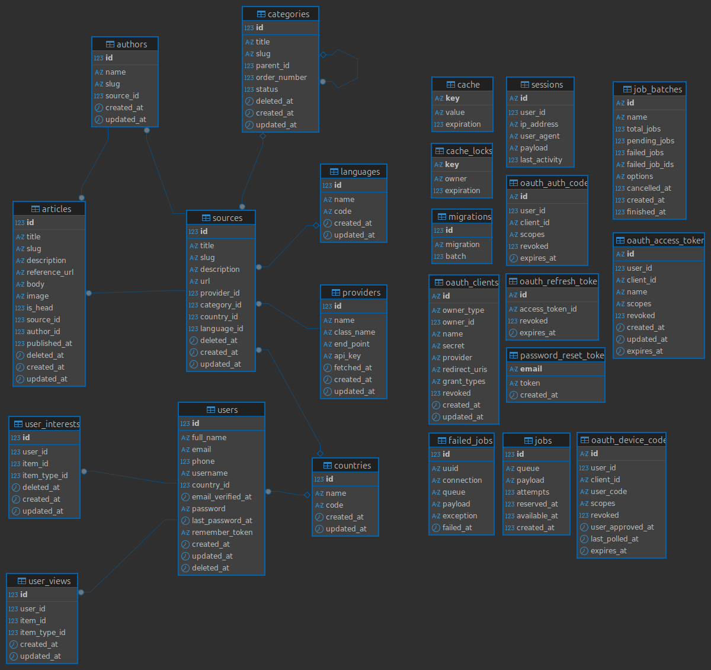

# Daily Scope

Live Preview: (https://daily-scope.abdelrahman.online)

Data Sources Used: NewsAPI - NewsAPIAi - NewsDataIO

-   [About](#about)
-   [Features](#features)
-   [Database Diagram](#database-diagram)
-   [Cache Service](#cache-service)
-   [Technologies](#technologies)
-   [Get Started](#get-started)
    -   [Postman Collection](#postman-collection)
    -   [Installation](#installation)
    -   [Docker](#docker)
    -   [Environment Configuration](#environment-configuration)
    -   [Register New Provider](#register-new-provider)
    -   [Fetch News](#fetch-news)

## About

This project is a **backend service** for a news provider website.  
It fetches articles from multiple external sources, stores them locally, and exposes clean API endpoints for frontend consumption.

## Features

1. **User Authentication & Registration:**
    - Enable account creation and login for saving preferences.
2. **Article Search & Filtering:**
    - Implement keyword-based search and filters for date, category, and source.
3. **Personalized News Feed:**
    - Allow users to customize their feed with preferred sources, categories, and authors.
4. **Mobile-Responsive Design:**
    - Optimize the website for a seamless mobile viewing experience.

## Database Diagram



## Cache Service

The application implements **Redis caching** to improve performance and reduce database load:

### Cached Endpoints
- **Top Headlines API** (`/api/v1.0/top-headings`) - 15-minute cache
- **Preferred Articles API** (`/api/v1.0/preferred/articles`) - 10-minute cache

### Cache Management
```bash
# Clear all home related caches
php artisan cache:clear-home

# Clear cache for specific user
php artisan cache:clear-home --user=1
```

## Technologies

### Backend Framework

-   **PHP**: ^8.4
-   **Laravel**: ^12.0

### Core Packages

-   **Laravel Modules**: ^12.0 - Modular Architecture
-   **Laravel Passport**: ^13.2 - API Authentication

### Development Tools

-   **PHP CS Fixer**: ^3.87 - Code Style Fixer
-   **PHPUnit**: ^11.5.3 - Testing Framework

### Database & Caching

-   **MySQL** - Primary Database
-   **Redis** - Caching
-   **Elasticsearch** - Long text search engine

### Infrastructure

-   **Docker** - Containerization
-   **Nginx** - Web Server
-   **PHP-FPM** - Process Manager

### Logging & Monitoring

-   **Kibana** - Log aggregation and visualization

## Get Started

### Postman Collection

[Open With Postman](https://www.postman.com/isemary/workspace/daily-scope)

Please note that there are 2 environments available: local and production, which makes it easier for you to verify the results.

### Installation

#### 1. Clone The Repository

    git clone https://github.com/iSemary/daily-scope.git

#### 2. Install Required Dependencies

    composer i

#### 3. Migrate Tables

    php artisan migrate
    php artisan module:migrate

#### 4. Install Passport Keys

    php artisan passport:install

#### 5. Generate Laravel App Key

    php artisan key:generate

#### 6. Run application local

    php artisan serve

#### 7. Configure Kibana Logging (Optional)

For advanced logging and monitoring, you can configure Kibana integration:

1. **Set up environment variables** in your `.env` file:
   ```env
   KIBANA_API_KEY=your_api_key_here
   KIBANA_CLOUD_ID=your_cloud_id_here
   KIBANA_INDEX=logs
   ```

2. **Switch logging methods**:
   - Storage File only: `LOG_STACK=single`
   - Kibana only: `LOG_STACK=kibana`
   - Both (default): `LOG_STACK=single,kibana`

## Docker

```
docker-compose up
```

## Environment Configuration

### API Keys Setup

The application uses environment variables for API keys to ensure security and flexibility across different environments.

#### Required Environment Variables

Add the following variables to your `.env` file:

```env
# News Provider API Keys
NEWSAPI_API_KEY=
NEWSDATAIO_API_KEY=
NEWSAPIAI_API_KEY=
```

#### API Keys for Testing

**📋 Note:** The API keys have been added to the Assessment PDF file to make it easy for testing the application. You can find the working API keys in the provided documentation.

## Register New Provider

### 🔑 Please note that i've added fresh keys to be able to test the 3 service providers.

### 🔒 The api_key column in the database is encrypted.

### ProviderSeeder

The application includes a `ProviderSeeder` that automatically seeds the database with the three main news providers:

- **NewsAPI** - https://newsapi.org/v2/
- **NewsDataIO** - https://newsdata.io/api/1/
- **NewsAPIAi** - http://eventregistry.org/api/v1/

#### Seeding Providers

1- **By Running the Database Seeder** (Recommended):

```bash
php artisan db:seed --class=Modules\\Provider\\Database\\Seeders\\ProviderSeeder
```

This will automatically create the three providers with their respective API keys from your environment variables.

2- **Through the POST API** in the Postman Collection:

```
{{API_URL}}/{{API_VERSION}}/providers/register
```

## Fetch News

There's a 2 ways to fetch the articles, categories, authors, and sources from the service providers.

1- By triggering the sync command through GET API call [For Test Purpose Only]:

```
{{API_URL}}/{{API_VERSION}}/providers/sync
```

2- By Running the command:

```
php artisan app:sync-news
```
